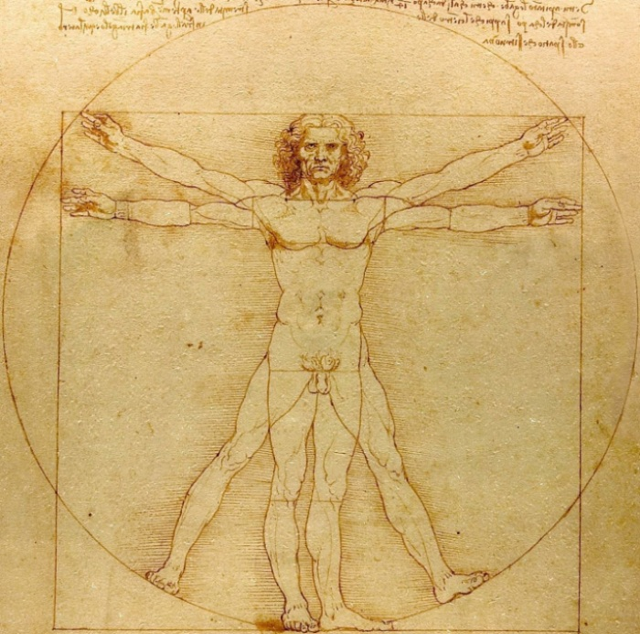

# Introduction

Travail en groupe par rapport à l'étude de la biométrie d'une population de Belgique. Les données ont été récolté par chaque membre de la classe sur des individus. Il y a différentes variable qui ont été mis dans notre tableau de données dans le but d'evaluer leur impact sur la valeur de l'IMC des individus.

L' IMC   ou indice de masse corporelle est une facon de mesurer la corpulence d'une personne.
Cette mesure à été inventée par Adolphe Quetelet ( un belge ) et se calcule comme valant le carré de la taille ( en mètre ) divisée par le masse ( en kg ).




# But

Notre but est déterminer le taux la répartition de l'IMC dans notre échantillonnage. Ainsi qu'essayer de déduire les causes pouvant influencer ces répartition de l'IMC.

# Matériel et méthodes utilisées

Nous avons utilisé Markdown et les données que tous les membres de la classe ont prélevé pour établir un tableau de données par la suite. Pour déterminer si un individu est en surpoids, on calcule l'IMC. C'est à dire "l'indicatif de masse corporel". Si notre individu a une IMC inférieur à 18.5, il est classé dans la catégorie "sous-poids", si une personne a un IMC entre 18.5 et en dessous de 25, elle se situe dans le groupe "normal", si un individu a un IMC égal ou supérieur à 25 et inférieur à 30 il est dans la catégorie "surpoids" et enfin les personnes ayant un indice dépaçant les 30, il est placé dans le groupe "obèse". 
L'IMC est un calcul fortement utilsé par le milieu médical pour déterminer dans quel groupe se situé l'individu et permettre d'agir en conséquence. 
Pour calculer l'IMC, il faut mesurer la masse(en kg) et la diviser par la taille (en mètre) au carré.

Le poids et la taille ( donc l'IMC) peut être influencer par toute une multitude de facteurs. Dans notre échantillonnage nous avons essaye de prendre en compte tout ces facteurs pouvant influencer l'IMC. Comme par exemple les habitudes alimentaires, les activités sportives,...

Dictionnaire de méthadonnées :

https://docs.google.com/document/d/1lgYD39W7vmVYyS5ea0wEl9ArE1dhuDRkIIBzZ4K6d_o/edit


# Résultats
## Importation des données et des outils nécessaires

```{r}
SciViews::R

# ! SI UNE COPIE LOCALE N'A PAS ENCORE ETE TELECHARGEE IL EST ESSENTIEL D'AVANT TOUT RUN TOUT LE R SCRIPT NOMME : DATA IMPORTATION.R !

biometry <- read("../data/biometry.rds")

head(biometry)
 
library(tidyverse)
library(plotly)
library(ggplot2)
library(ggExtra)
data(mpg, package="ggplot2")
library(ggridges)

```


## Tableau comparatif:

### Moyenne du poids et moyenne de taille 

```{r}

filter (biometry, taille>0, masse_corr >0 , )%>.%

  summarise(. ,
  "moyenne taille" = mean(taille), 
  "moyenne masse" = mean(masse_corr)) %>.%

  knitr::kable(., digits = 2)

```
## Répartition de l' IMC

 On peut se demander si dans notre population on a autant de personne pour lequels l'IMC est dit : obeses , surpoids , souspoids et pour finir normal.
 
### Visualisations
```{r}
chart(data = biometry, ~ IMC_RAP %fill=%IMC_RAP) +
  geom_bar(width = 1) +
  scale_fill_viridis_d()
```

#### Analyse

Le pourcentage le plus important est celui de la catégorie "normal". On a ensuite les "surpoids" puis les "obèses" pour terminer par les "sous-poids". La partie la plus faible de la population est le groupe des "sous-poids". Ces pourcentages correspondent bien à la zone d'échantillonage en effet la majorité des individus sont situé dans des régions développés, avec des ressources alimentaires suffisantes.

```{r}

a <- chart(biometry, ~ IMC_RAP) +
  geom_bar() + coord_flip()

b <-chart(biometry, ~ age_rec %fill=% age_rec) +
  geom_bar() + coord_flip()

c <- biometry %>.%
  filter(., IMC_RAP == "normal" ) %>.%
  chart(., ~ age_rec %fill=% age_rec) +
  geom_bar() + coord_flip()

combine_charts(list (a,b,c))

```

```{r}
group_by(biometry, age_rec , IMC_RAP)%>.%
summarise (., n = n() )%>.%
spread(., key = "IMC_RAP" , value="n")%>.%

head(.)
```

#### Analyse

les graphiques semblent clair on voit bien que les classes ne sont pas uniformement répartie dans la population avec une prédominance des individus "normaux".Ceci est encore plus appuyé par le test suivant:

### Test chi carré

voici nos 2 hypothèses:

H0 :La répartition des 4 groupes d'IMC dans la population est égales.

H1 : La répartition diffère

```{r}
biometry %>.%
group_by(.,IMC_RAP)%>.%
summarise (., n = n() )%>.%
spread(., key = "IMC_RAP" , value="n")-> biometry_chi


biometry_chi
```


```{r}
chisq.test(biometry_chi, p = c(1/4, 1/4,1/4,1/4), rescale.p = FALSE)
```

#### Analyse

Ici le test Chi Carré nous indique un p-value extremement faible de 2.2e-16  la différence est donc très significative 

### Discussion du test chi carré

Nos groupes d'IMC ne sont pas répartri équitablement dans la population on observe par exemple beaucoup plus d'individus "normaux " et les individus qualifié de " souspoids"sont en très faible effectif.


## Différence entre les individus 

### Les différences liées au genre

#### Répartition de la masse en fonction du genre

Est ce que la masse corrigée des personnes est identique dans la population selon le genre ou es ce que l'un des genres est en moyenne plus lourd que l autre ?:

observons ceci tout d'abord par une représentation graphique pour avoir une idée.


##### Graphique
```{r}
biometry<-filter(biometry, genre !="NA")

give_n <- function(x)
  c(y = max(x) * 1.1, label = length(x)) 

chart(data = biometry, masse_corr ~ genre %fill=% genre) +
  geom_boxplot(na.rm = TRUE) + stat_summary(fun.data = give_n, geom = "text", hjust = 0.5)
```

###### Analyse

Sur le graphique, il semble que les hommes (sex == "h") tendent à avoir une masse corrigée plus grande (variable masse-corr) que les femmes (sex == "f"), mais cette différence est-elle significative ou peut-elle être juste liée au hasard de l’échantillonnage ? Pour y répondre, nous devons élaborer un test de student qui va confronter les hypothèses suivantes (en se basant sur les moyennes) :

##### Test de student

voici nos 2 hypothèses :

H0:la différence des moyennes entre mesures pour les femmes et pour les hommes= 0

H1:la différence des moyennes entre mesures pour les femmes et pour les hommes≠ 0


test de student :

```{r}
t.test(data = biometry, masse_corr ~ genre,
  alternative = "two.sided", conf.level = 0.95, var.equal = TRUE)
```
##### Analyse 

Prenons une valeur de α de 5% , (α = 0.05).On compare notre valeur de α avec notre valeur de p qui est de: p-value=5.601e-09.

comme p <<<< α on rejette Ho qui se situe dans la zone de rejet.

##### Representation graphique des distributions:


```{r}
filter(biometry, genre !="NA",masse_corr !="NA")

biometry %>.%
group_by(.,genre) %>.%
summarise(.,"moyenne" = mean(masse_corr),
"ecart_type" = sd(masse_corr))


```

```{r}
sd(biometry$masse_corr)
(65.2120 + 78.3392)/2#moyenne des moyennes
```

```{r}
.mu <-0;.s <-1 ; .mu +.s *qt(0.025, df = 248, lower.tail = FALSE)
.mu <-0;.s <-1 ; .mu +.s *qt(0.025, df = 248, lower.tail = TRUE)
.mu <-0;.s <-1 ; .mu +.s *qt(5.601e-09
, df = 248, lower.tail = TRUE)
```


```{r}
# Student's t distribution (density probability) with parameters:
.mu <- 0; .s <- 1; .df <- 248 # .mu, .s (sigma) and .df
.col <- 1; .add <- FALSE # Plot parameters
.x <- seq(-4.5*.s+.mu, 4.5*.s+.mu, l = 1000)     # Quantiles
.d <- function (x) dt((x-.mu)/.s, df = .df)/.s   # Distribution function
.q <- function (p) qt(p, df = .df) * .s + .mu    # Quantile for lower-tail prob
.label <- bquote(t(.(.mu), .(.s), .(.df)))       # Parameters
curve(.d(x), xlim = c(-10,7), xaxs = "i", n = 1000, col = .col,
  add = .add, xlab = "Quantiles", ylab = "Probability density" ) # Curve
abline(h = 0, col = "gray") # Baseline
abline(v = -1.96, col = "red")
abline(v = 1.96, col = "red")
abline(v = -5.91, col = "green")
```

le quantile correspondant à l'hypothèse H0 (ligne verte)est situé dans la zone de rejet ( a gauche du quantile α(verticale rouge)) on rejette donc l'hypothèse H0.

##### Discussion du test de student

On en conclu donc que l'hypothèse H1 est correcte et que la moyenne de la masse corrigée dans notre population sera significativement plus importante chez les hommes que chez les femmes.

#### Répartition de la taille en fonction du genre

On peut maintenant se demander si la taille des personnes est identique dans la population selon le genre ou est-ce que l'un des genres est en moyenne plus grand que l autre ?

##### Visualisations :


```{r}

filter (biometry, taille>0, masse_corr >0 , ) %>.%
group_by(., genre)%>.%
summarise(.,
  "moyenne taille" = mean(taille), 
  "moyenne masse" = mean(masse_corr))%>.%
knitr::kable(., digits = 2)
```

```{r}
chart(data= biometry, taille ~ masse_corr %col=%genre) +
  geom_point()
```

##### Analyse

Les femmes sont en moyenne plus petites que les hommes et ont logiquement un masse plus petite que les hommes.

```{r}
biometry<-filter(biometry, genre !="NA")

give_n <- function(x)
  c(y = max(x) * 1.1, label = length(x)) 

chart(data = biometry, taille ~ genre %fill=% genre) +
  geom_boxplot(na.rm = TRUE) + stat_summary(fun.data = give_n, geom = "text", hjust = 0.5)

```

##### Analyse

Sur le graphique, il semble que les hommes (sex == "h") tendent à avoir une taille plus grande (variable taille) que les femmes (sex == "f"), mais cette différence est-elle significative ou peut-elle être juste liée au hasard de l’échantillonnage ? Pour y répondre, nous devons élaborer un Test de Wilcoxon-Mahn-Withney qui va confronter les hypothèses suivantes (en se basant sur les médianes) :

##### Test de Wilcoxon

Dans le test de student nous avons supposé que la distribution de départ était de type normal.Or lorsqu'on a un faible échantillonage on peut douter que la distribution suis bien une loi normale on va donc utiliser un autre test celui de Test de Wilcoxon-Mahn-Withney une version non-paramétrique du test de student.

voici nos 2 hypothèses:

H0:P(taillef>tailleh)=P(taillef<tailleh)
H1:P(taillef>tailleh)≠P(taillef<tailleh)

```{r}
wilcox.test(data = biometry, taille ~ genre,
  alternative = "less", conf.level = 0.95)
```

##### Analyse 

Prenons une valeur de α de 5% , (α = 0.05).On compare notre valeur de α avec notre valeur de p qui est de: p-value=2.2e-16.

comme p <<<< α on rejette Ho qui se situe dans la zone de rejet.


##### Discussion du test de wilcoxon

On en conclu donc que l hypothèse H1 est correcte et que la moyenne de la taille dans notre population sera significativement plus importante chez les hommes que chez les femmes.

#### Répartition de l'IMC en fonction du genre

```{r}
chart(data = biometry, ~IMC_RAP %fill=% genre ) +
  geom_bar(position = "dodge")
```

##### Analyse

Lorsqu'on compare les hommes et les femmes, on remarque que le pourcentage de femmes est plus importante pour la catégorie "normal" et "souspoid". Et le pourcentage d'homme est plus important pour le "surpoid" et "obese".On peut donc constater que les hommes ont un pourcentage de "surpoids" et "obese" plus important que les femmes.


### Les différences lié à l'âge

```{r}

group_by(biometry, age_rec)%>.%

summarise(.,
  "moyenne taille" = mean(taille), 
  "moyenne masse" = mean(masse_corr))%>.%

head(.)
```

#### Analyse

On remarque sur ces moyennes que les 60-110 ont une taille plus petite mais possède un poids dans les alentour des individus adulte. Les 0-20 ont une taille un peu près identique à celle des adultes cependant leur moyenne pour le poids est plus faible. On peut comprendre que l'IMC des personne agés sera plus important que l'IMC des jeunes. Cela s'explique par le faite que les jeunes viennent de terminer leur croissance et le corps utilise des ressources pour grandir. Par la suite le corps adulte se nourrit pour survivre, il n'avait plus besoin de nourriture supplémentaire pour sa croissance.

#### Etude de la masse en fonction ds catégories d'age.

Imaginons que nous voulons comparer la masse corrigée des individus en fonction de leur age (on formera une variable facteur en formant des groupes d'ages(plus de deux)).


##### Graphiques et visualisations

```{r}
biometry %>.%
  group_by(., age_rec) %>.%
  filter(.,age_rec !="NA",masse_corr !="NA")%>.%
  summarise(., mean = mean(masse_corr), sd = sd(masse_corr), count = sum(!is.na(masse_corr)))
```

```{r}
biometry %>.%
  group_by(., age_rec) %>.%
  filter(.,age_rec !="NA")%>.%
  chart(data = .,masse_corr ~ age_rec) + # Je réalise un graphique 
  geom_violin() + # Je réalise un graphique en violon
  geom_jitter(width = 0.05, alpha = 0.5) + # J'ajoute les points sur le graphique 
  stat_summary(geom = "point", fun.y = "mean", color = "green", size = 4) # J'ajoute la moyenne en vert
```

##### Analyse

On semble voir une différence entre les différentes classes mais cette différence est-elle significatice ou pas ? Pour le savoir on va réaliser  un test de Kruskal-Wallis ou utiliser le modèle de l'ANOVA:

##### ANOVA ou Kruskal-Wallis ?

Nous pourrions comparer chaque groupe l'un avec l'autre c'est long et nous ne le ferons pas car à chaque test nous prenons un risque de nous tromper. Le risque de se tromper au moins une fois dans l’ensemble des tests est alors décuplé en cas de tests multiples.

On ne peut plus utiliser le test de student ou de wilcoxon car on compare plus de deux population ! On va donc utiliser le test de Kruskal-Wallis ou le modèle de l'ANOVA:

test anova:

on a maintenant prit connaissance de nos données on va se demander si il y a homoscédasticité des variances via un test de Barlett:

dont les hypothèses sont:

H0:var1=var2=...=vark     (homoscédasticité)
H1:∃(i,j) tel que vari≠varj       (hétéroscédasticité)

```{r}

biometry %>.%
  group_by(., age_rec) %>.%
  filter(.,age_rec !="NA",masse_corr!="NA")%>.%
bartlett.test(data = .,masse_corr ~ age_rec)
```

ici la p-value est plus petite qu'alpha (0.05) ont rejette donc H0, on a besoin que H0 soit non rejettée pour utiliser le modèle de l'ANOVA sinon on se rabattra sur un test de Kruskal-Wallis:

```{r}

biometry %>.%
  group_by(., age_rec) %>.%
  filter(.,age_rec !="NA",masse_corr!="NA")%>.%
bartlett.test(data = .,log(masse_corr) ~ age_rec)
```

ici la p-value est supérieur a alpha(0.05) on peut donc utiliser l'ANOVA avec log(masse-corr)

##### Visualisation de la nouvelle variable:

```{r}
biometry %>.%
  group_by(., age_rec) %>.%
  filter(.,age_rec !="NA",masse_corr !="NA")%>.%
  summarise(., mean = mean(log(masse_corr)), sd = sd(log(masse_corr)), count = sum(!is.na(log(masse_corr))))
```

```{r}
biometry %>.%
  group_by(., age_rec) %>.%
  filter(.,age_rec !="NA")%>.%

chart(data = .,log(masse_corr) ~ age_rec) + # Je réalise un graphique 
  geom_violin() + # Je réalise un graphique en violon
  geom_jitter(width = 0.05, alpha = 0.5) + # J'ajoute les points sur le graphique 
  stat_summary(geom = "point", fun.y = "mean", color = "green", size = 4) # J'ajoute la moyenne en vert
```

avant de continuer on dois vérifier si la distibution est bien de type normale pour pouvoir utiliser l'ANOVA :

```{r}


anova(anova. <- lm(data = biometry, masse_corr ~ age_rec))

#plot(anova., which = 2)
anova. %>.%
  chart(broom::augment(.), aes(sample = .std.resid)) +
  geom_qq() +
  #geom_qq_line(colour = "darkgray") +
  labs(x = "Theoretical quantiles", y = "Standardized residuals") +
  ggtitle("Normal Q-Q")
```

##### Analyse

on observe que la distribution est non normale pour les valeurs plus importante on prèferera donc utiliser le modèle non paramétrique du test de Kruskal-Wallis.

##### Test de Kruskal-Wallis

Dans le test de Kruskal-Wallis, sous H0 nous avons le même rang moyen (noté mr) pour chaque groupe parmi k. Sous H1, au moins deux groupes ont des rangs moyens différents:

H0:mr1=mr2=...=mrk

H1:∃(i,j) tel que mri≠mrj

```{r}
kruskal.test(data = biometry, masse_corr ~ age_rec)
```

##### Analyse

comme p-value est bien plus petit qu'alpha (0.05) on rejette H0 et on peut dire qu'il existe au moins une différence significative entre les ratios .

##### Test post hoc

on a déterminé une différence significative mais est-elle présente entre tout les groupes ou seulement entre certain ? On réalise un test post hoc pour le savoir(test de tukey):

```{r}
summary(kw_comp. <- nparcomp::nparcomp(data = biometry, masse_corr ~ age_rec))
```

```{r}
plot(kw_comp.)
```

##### Discussion du test de Kruskal 

Ici, toutes les différences sont considérées comme significatives sauf  la comparaison des [20-50]-[50-100] avec une valeur P tout juste non significative de 6.833583e-02 mais à prendre avec des pincettes étant donné sa proximité du seuil.


#### Etude de la relation masse <-> taille en fonction de la catégorie d'âge.

```{r}
chart(data= biometry, taille ~ masse %col=% age_rec) +
  geom_point()+ geom_smooth(se= FALSE)
```

##### Analyse

Sur le graphique, ce graphique est très intéressant car grâce à lui on constate que la taille et le poids varie bien en fonction de l'âge.Les personnes de 0 à 20 possédes en moyenne l'IMC le plus petit car notre courbe est situé dans la partie supérieur du graphique. Alors que les personnes plus agés 40 à 60 et 60 à 110 sont situé dans la partie basse du graphique ce qui signifie que l'IMC est plus élevé. 

#### Répartition de l'IMC  en fonction des catégories d'age.

```{r}
chart(data = biometry, ~IMC_RAP %fill=% age_rec ) +
  geom_bar(position = "dodge") + coord_flip()
```

##### Analyse

Ce graphique est intéressant. Grâce à ce graphe, on remarque que notre échantillonage aléatoire n'est pas parfait en effet il y a une grande quantité de jeune individus et très peu d'individus plus agés. 
Mais si on passe au dessus des erreurs d'échantillonnage, les valeurs sont intéressant.Pour le groupe sous-poids, nous n'avons pas d'individus au delà de 40 ans. Pour la catégorie normal on remarque que la quantité d'individus varie en fonction de l'âge.Le pourcentage de personne dépassant les 40 ans dans le groupe surpoids et obèses est beaucoup plus important que dans le groupe de souspoids qui est égale à 0 et le groupe normal. En conclusion, ce graphique nous conforte dans nos affrimations dites plus haut: Plus les individus vieillissent plus leur IMC grandit.

```{r}


chart(biometry, ~ age_rec %fill=% age_rec) +
  geom_bar() + coord_flip()

biometry %>.%
  filter(., IMC_RAP == "normal" ) %>.%
  chart(., ~ age_rec %fill=% age_rec) +
  geom_bar() + coord_flip()


```

```{r}
group_by(biometry, age_rec , IMC_RAP)%>.%
summarise (., n = n() )%>.%
spread(., key = "IMC_RAP" , value="n")%>.%

head(.)
```

##### Analyse

Pour les individus à delà de 40 ans la majorité de groupe se situe dans la catégorie surpoids avec aucuns individus pour la catégorie sous-poids

## Causes pouvant influencer l'IMC de nos individus.

### Alcool

```{r}
biometry_alcoolA <-  filter (biometry,IMC_RAP == "souspoid"  )
biometry_alcoolA <- summarise (biometry_alcoolA, " souspoid" = mean(alcool))

biometry_alcoolB <-  filter (biometry,IMC_RAP == "obese"  )
biometry_alcoolB <- filter (biometry_alcoolB, alcool != "NA")

biometry_alcoolB <- summarise (biometry_alcoolB, " obese" = mean(alcool))

biometry_alcoolC <-  filter (biometry,IMC_RAP == "surpoid"  )
biometry_alcoolC <- filter (biometry_alcoolC, alcool != "NA")
biometry_alcoolC <- summarise (biometry_alcoolC, "surpoid" = mean(alcool))

biometry_alcoolD <-  filter (biometry,IMC_RAP == "normal"  )
biometry_alcoolD <- filter (biometry_alcoolD, alcool != "NA")

biometry_alcoolD <- summarise (biometry_alcoolD, "normal" = mean(alcool))

biometry_alcool <- bind_cols( biometry_alcoolA, biometry_alcoolD, biometry_alcoolC, biometry_alcoolB)
knitr::kable(biometry_alcool, digits = 2)

```

#### Analyse

On constate que la moyenne d'alcool pour les différents groupes ("souspoids", "normal", "surpoids","obèse") augmente en même temps que le IMC , on peut donc faire une corrélation entre les 2 variables. Ce lien constiste à dire que la consommation d'alcool entraine l'augmentation de l'IMC cependant il faut prendre ces résultats avec précautions car nous avons des valeurs extrèmes qui faussent notre moyenne est l'écart des valeurs réelles de la majorité de la population. 

```{r}
p=ggplot(biometry, aes(x= alcool, y= IMC , color= IMC_RAP, shape= genre)) + 
    geom_point(size=1, alpha=0.6)

ggplotly(p)
```

```{r}

chart(data = biometry, ~ alcool %fill=% IMC_RAP | IMC_RAP) +
  geom_histogram(data = select(biometry, -IMC_RAP), fill = "grey", bins = 25) + 
  geom_histogram(show.legend = FALSE, bins = 25, na.rm = FALSE) +
  ylab("Effectifs") +
  scale_fill_viridis_d()
chart(data = biometry, alcool ~ IMC_RAP %fill=% IMC_RAP) + geom_boxplot(show.legend = FALSE)

```

#### Analyse

Les graphiques nous confirment nos premières analyses . Les individus en sous-poids prennent moins d'alcool que les individus en surpoids.
On peut également mettre en lien, l'age et l'alcool car on a constaté plus tôt que les individus jeunes sont en général plus en sous-poids que les adultes et les personnes agés. Dans notre catégorie de jeune, il y a des personnes ayant un age inférieur à 16 ans qui est la limite d'autorisation pour l'alcool, les individus plus agé sont plus confronté à l'alcool que les jeunes.
Attention cependant, beaucoup d'autres facteurs peut interférer.

### Grignotage

```{r}
biometry_grignotageA <-  filter (biometry,IMC_RAP == "souspoid"  )
biometry_grignotageA <- filter (biometry_grignotageA, grignotage != "NA")
biometry_grignotageA <- summarise (biometry_grignotageA, " Sous-poids" = mean(grignotage))

biometry_grignotageB <-  filter (biometry,IMC_RAP == "obese"  )
biometry_grignotageB <- filter (biometry_grignotageB, grignotage != "NA")

biometry_grignotageB <- summarise (biometry_grignotageB, "Obèse" = mean(grignotage))

biometry_grignotageC <-  filter (biometry,IMC_RAP == "surpoid"  )
biometry_grignotageC <- filter (biometry_grignotageC, grignotage != "NA")
biometry_grignotageC <- summarise (biometry_grignotageC, "Surpoids" = mean(grignotage))

biometry_grignotageD <-  filter (biometry,IMC_RAP == "normal"  )
biometry_grignotageD <- filter (biometry_grignotageD, grignotage != "NA")

biometry_grignotageD <- summarise (biometry_grignotageD, "Normal" = mean(grignotage))

biometry_grignotage <- bind_cols( biometry_grignotageA, biometry_grignotageD, biometry_grignotageC, biometry_grignotageB)
knitr::kable(biometry_grignotage, digits = 2)
```


#### Analyse


Pour les moyennes du grignotage, le groupe du "souspoids" à la moyenne la plus forte est le groupe "obèse" possède la moyenne la plus faible. Ces résultats sont très intéressant on peut voir un lien entre l'IMC et le grignotage.En moyenne les personnes grignotant beaucoup ont un poids plus faible.Cependant les différences entre les moyennes sont relativement faible et il faut faire attention aux valeurs extrèmes qui peuvent influencé la moyenne. Il faut prendre ces résultats avec des pincettes car nous avons pas déterminer le type de grignotage : fruits ou friandises.

```{r}
p=ggplot(biometry, aes(x= grignotage, y= IMC , color= IMC_RAP, shape= genre)) + 
    geom_point(size=1, alpha=0.6)

ggplotly(p)
```

```{r}
nbins <- 25
chart(data = biometry, ~ grignotage %fill=% IMC_RAP | IMC_RAP) +
  geom_histogram(data = select(biometry, -IMC_RAP), fill = "grey", bins = nbins) + 
  geom_histogram(show.legend = FALSE, bins = nbins, na.rm = FALSE) +
  ylab("Effectifs") +
  scale_fill_viridis_d()
```


```{r}
give_n <- function(x)
  c(y = max(x) * 1.1, label = length(x)) 
chart(data = biometry, grignotage ~ IMC_RAP %fill=% IMC_RAP) + geom_boxplot(show.legend = FALSE)+ stat_summary(fun.data = give_n, geom = "text", hjust = 0.5)

```

#### Analyse

Sur les graphiques, on constate qu'il n'y a pas de différences significatives entre les individus
Les moyennes étaient légèrement différentes à cause des valeurs extrèmes. 

### Protéine animale

```{r}
biometry_PA <-  filter (biometry,IMC_RAP == "souspoid"  )
biometry_PA <- filter (biometry_PA, proteine_animale != "NA")
biometry_summaryA4 <- summarise (biometry_PA, "Sous-poids" = mean(proteine_animale))

biometry_PB <-  filter (biometry,IMC_RAP == "obese"  )
biometry_PB <- filter (biometry_PB, proteine_animale != "NA")
biometry_summaryB4 <- summarise (biometry_PB, "Obèse" = mean(proteine_animale))

biometry_PC <-  filter (biometry,IMC_RAP == "surpoid"  )
biometry_PC <- filter (biometry_PC, proteine_animale != "NA")
biometry_summaryC4 <- summarise (biometry_PC, "Surpoids" = mean(proteine_animale))

biometry_PD <-  filter (biometry,IMC_RAP == "normal"  )
biometry_PD <- filter (biometry_PD, proteine_animale != "NA")
biometry_summaryD4 <- summarise (biometry_PD, "Normal" = mean(proteine_animale))

biometry_proteine_animale <- bind_cols( biometry_summaryA4, biometry_summaryD4, biometry_summaryC4, biometry_summaryB4)
knitr::kable(biometry_proteine_animale, digits = 2)
```

#### Analyse

Le groupe des "souspoids" possède la moyenne la plus faible et le groupe"obèse" possède la moyenne la plus grande. On peut conclure que les protéines animales ont une influence avec la prise de poids. Pour la catégorie "normal"et"surpoids"les valeurs sont assez proche. Il doit y avoir un autre facteur qui doit influencé l'IMC.

```{r}
nbins <- 25
chart(data = biometry, ~ proteine_animale %fill=% IMC_RAP | IMC_RAP) +
  geom_histogram(data = select(biometry, -IMC_RAP), fill = "grey", bins = nbins) + 
  geom_histogram(show.legend = FALSE, bins = nbins, na.rm = FALSE) +
  ylab("Effectifs") +
  scale_fill_viridis_d()

```


```{r}
give_n <- function(x)
  c(y = max(x) * 1.1, label = length(x)) 
chart(data = biometry, proteine_animale ~ IMC_RAP %fill=% IMC_RAP) + geom_boxplot(show.legend = FALSE)+ stat_summary(fun.data = give_n, geom = "text", hjust = 0.5)

```

#### Analyse

Le graphique nous révèle que les personnes en sous-poids prennent une quantité moins importante de viande. Pour le groupe "obèse". Le manque de protéine animal entraine le sous-poids.Et la surconsommation de protéine animal nous indique que cela peut entrainer une augmentation de l'IMC.

### Fastfood

```{r}
biometry_fastfoodA <-  filter (biometry,IMC_RAP == "souspoid"  )
biometry_fasfoodA <- filter (biometry_fastfoodA, fastfood != "NA")
biometry_summaryA2 <- summarise (biometry_fastfoodA, "Sous-poids" = mean(fastfood))

biometry_fastfoodB <-  filter (biometry, IMC_RAP == "obese"  )
biometry_fastfoodB <- filter (biometry_fastfoodB, fastfood != "NA")
biometry_summaryB2 <- summarise (biometry_fastfoodB, "Obèse" = mean(fastfood))

biometry_fastfoodC <-  filter (biometry,IMC_RAP == "surpoid"  )
biometry_fastfoodC <- filter (biometry_fastfoodC, fastfood != "NA")
biometry_summaryC2 <- summarise (biometry_fastfoodC, "Surpoids" = mean(fastfood))

biometry_fastfoodD <-  filter (biometry,IMC_RAP == "normal"  )
biometry_fastfoodD <- filter (biometry_fastfoodD, fastfood != "NA")
biometry_summaryD2 <- summarise (biometry_fastfoodD, "Normal" = mean(fastfood))

biometry_fastfood<- bind_cols( biometry_summaryA2, biometry_summaryD2, biometry_summaryC2, biometry_summaryB2)
knitr::kable(biometry_fastfood, digits = 2)


```

#### Analyse

Ici les moyennes donnent des conclusions moins significatives. On remarque que la moyenne la plus faible est attribuée à la catégorie du "souspoids", cependant la moyenne la plus forte est celle du groupe normal.Dans les groupes "souspoids","surpoids" et "obèse" on a une augmentation lié à la montée du IMC. Le groupe"normal" ne suit pas notre hypothèse, les différentes raisons sont que soit les fastfood n'ont pas de lien avec la prise de point ou soit nous avons oublié de tenir compte d'une autre variable pouvant influencer sur l'IMC ( la 2ème hypothèse va s'avèré être la bonne)

```{r}
nbins <- 25
chart(data = biometry, ~ fastfood %fill=% IMC_RAP | IMC_RAP) +
  geom_histogram(data = select(biometry, -IMC_RAP), fill = "grey", bins = nbins) + 
  geom_histogram(show.legend = FALSE, bins = nbins, na.rm = FALSE) +
  ylab("Effectifs") +
  scale_fill_viridis_d()

```


```{r}
give_n <- function(x)
  c(y = max(x) * 1.1, label = length(x)) 
chart(data = biometry, fastfood ~ IMC_RAP %fill=% IMC_RAP) + geom_boxplot(show.legend = FALSE)+ stat_summary(fun.data = give_n, geom = "text", hjust = 0.5)

```

#### Analyse

On peut remarquer que le groupe sous-poids mange moins de fastfood.Le faite de manger plus souvent amène donc à un IMC plus important. Cependant pour les autres groupes il n'y a pas de différences significatives. Il doit y avoir un autre facteur qui influence les 3 groupes. Surtout pour le groupe normal qui en général mange environ une même quantité de fastfood que le groupe obèse. 

### Activités physique

```{r}
biometry_SA <-  filter (biometry,IMC_RAP == "souspoid"  )
biometry_SA <- filter (biometry_SA, acti_physique != "NA")
biometry_SA <- summarise (biometry_SA, "Sous-poids" = mean(acti_physique))

biometry_SB <-  filter (biometry,IMC_RAP == "obese"  )
biometry_SB <- filter (biometry_SB, acti_physique != "NA")
biometry_SB <- summarise (biometry_SB, "Obèses" = mean(acti_physique))

biometry_SC <-  filter (biometry,IMC_RAP == "surpoid"  )
biometry_SC <- filter (biometry_SC, acti_physique != "NA")
biometry_SC <- summarise (biometry_SC, "Surpoids" = mean(acti_physique))

biometry_SD <-  filter (biometry,IMC_RAP == "normal"  )
biometry_SD <- filter (biometry_SD, acti_physique != "NA")
biometry_SD <- summarise (biometry_SD, "Normal" = mean(acti_physique))

biometry_S <- bind_cols( biometry_SA, biometry_SD, biometry_SC, biometry_SB)

knitr::kable(biometry_S, digits = 2)
```

#### Analyse

Les individus fesant le plus de sport sont ceux avec l'IMC le plus faible. On peut en conclure que le sport diminue l'IMC des individus. Cependant on peut remarqué que le groupe fesant le plus de sport est le groupe normal et non le groupe sous-poids. 
La raison de cette variation inattendu sont les autres facteurs influençant l'IMC.Le groupe "normal" fait plus de sport mais il mange également plus de fastfood.

```{r}
nbins <- 25
chart(data = biometry, ~ acti_physique %fill=% IMC_RAP | IMC_RAP) +
  geom_histogram(data = select(biometry2, -IMC_RAP), fill = "grey", bins = nbins) + 
  geom_histogram(show.legend = FALSE, bins = nbins, na.rm = FALSE) +
  ylab("Effectifs") +
  scale_fill_viridis_d()

```

```{r}
give_n <- function(x)
  c(y = max(x) * 1.1, label = length(x)) 
chart(data = biometry, acti_physique ~ IMC_RAP %fill=% IMC_RAP) + geom_boxplot(show.legend = FALSE)+ stat_summary(fun.data = give_n, geom = "text", hjust = 0.5)

```

#### Analyse

Les graphiques nous montrent bien que les 2 groupes les plus fins sont les groupes fesant le plus de sports. Le sport influence la diminution de l'IMC


### Activités professionnels

```{r}
a <- filter(biometry, IMC_RAP == "souspoid")%>.%
  chart(., ~ factor(0) %fill=% acti_profession) +
  geom_bar(width = 1) + 
  coord_polar("y", start = 0) +
  theme_void() +
  scale_fill_viridis_d()

b <- filter(biometry, IMC_RAP == "normal")%>.%
  chart(., ~ factor(0) %fill=% acti_profession) +
  geom_bar(width = 1) + 
  coord_polar("y", start = 0) +
  theme_void() +
  scale_fill_viridis_d()

c <- filter(biometry, IMC_RAP == "surpoid")%>.%
  chart(., ~ factor(0) %fill=% acti_profession) +
  geom_bar(width = 1) + 
  coord_polar("y", start = 0) +
  theme_void() +
  scale_fill_viridis_d()

d <- filter(biometry, IMC_RAP == "souspoid")%>.%
  chart(., ~ factor(0) %fill=% acti_profession) +
  geom_bar(width = 1) + 
  coord_polar("y", start = 0) +
  theme_void() +
  scale_fill_viridis_d()

combine_charts(list(a, b, c, d), common.legend = TRUE, labels = c("sous-poids", "normal", "surpoids", "obèse"))

```

#### Analyse

On ne peut pas tirer de conclusions pouvant influencer l'IMC, les autres facteurs mesurés semble avoir plus d'importance que l'activité professionel. Les raisons de se méfier des valeurs sont que les groupes obèse et le groupe sous-poids ont environ les mêmes proportions alors que l'IMC est très différents entre les 2. 
Les raisons de ces incohérences pourrez être dû aux autres valeurs, les individus ayant une vie sédentaire vont la compenser en fesant plus de sport.
La séparation entre les différents groupes n'est pas précis. A partir que quel moment , on peut considèré qu'un individu fait une activité professionnel intermédiaire.


# Discussion

Le tableau de données nous a apporté énormément d'informations et de résultats. Cela nous a permis de déterminer comment se comportait l'IMC en fonction des groupes formés ( en fonction de l'age, ou du genre). Mais ce tableau nous a permis aussi de déterminer quelques élèments pouvant influencer l'IMC.

La première partie de nos analyses abordent les valeurs en général. La portion la plus importante de notre échantillon possède un IMC normal. Suivi par les surpoids et les obèses. La catégorie d'IMC la plus petite est la catégorie sous-poids. Ces pourcentages sont très logiques car la zone d'échantillonage a était réalisé principalement dans le hainaut et dans tout les cas dans des régions fortement développé. Le manque de ressource n'est donc en majorité pas un problème dans notre population d'individus.
Nos différentes catégories étant faite, on peut constater qu'elles ne sont pas équivalent. Il faudra donc en tenir compte lorsqu'on va procéder à d'autre analyses graphiques. La catégorie sous-poids étant en sous effectif les valeurs pourrait être erroné.

La deuxième partie de nos analyses discutent des variations de l'IMC en fonction de l'age et du genre. Notre analyse va déterminé si il y a des différences au niveau de l'imc entre les catégories d'age et les hommes et les femmes. 
Lorsqu'on analyse nos résultats, il y a bien une différence entre le poids et la taille pour les homme est les femmes , et donc par conséquence une différence dans l'IMC.
Lorsqu'on analyse l'IMC en fonction du genre, on observe bien une lèger différence, le pourcentage de femmes est plus importante pour la catégorie "normal" et "souspoid". Et le pourcentage d'homme est plus important pour le "surpoid" et "obese".On peut donc en conclure que les hommes ont un pourcentage de "surpoids" et "obese" plus important que les femmes.Mais pourquoi cette différence quel sont les facteurs influençant cette différence. Il y a une hypothèse qui pourraient être apporter.L'hypothèse est que les femmes font plus attention à leur poids , elle ont donc en moyenne un IMC plus faible que les hommes.
Ensuite, nous avons mesuré l'IMC en fonction de l'âge et ici également on a pu observer des valeurs intéressantes.Les 60-110 ont une taille plus petite mais possède un poids dans les alentours des individus adulte. Les 0-20 ont une taille un peu près identique à celle des adultes cependant leur moyenne pour le poids est plus faible.On peut comprendre que l'IMC des personnes agés sera plus important que l'IMC des jeunes.Lorsqu'on réalise un graphique on remarque en effet des courbes intéressants. Les personnes de 0 à 20 possédent en moyenne l'IMC le plus petit car notre courbe est situé dans la partie supérieur du graphique. Alors que les personnes plus agés 40 à 60 et 60 à 110 sont situé dans la partie basse du graphique ce qui signifie que l'IMC est plus élevé.
L'IMC augmente donc bien en fonction de l'age. 
Notre échantillonage aléatoire n'est pas parfait en effet il y a une grande quantité de jeune individus et très peu d'individus plus agés. Lorsqu'on sépare les catégories, on ressent aussi qu'il y a des erreurs au niveau de l'échantillonage qui ne semble pas assez aléatoire, mais si on passe au-dessus de cela, on peut observer aussi des valeurs très surprenants, en effet pour le groupe sous-poids, nous n'avons pas d'individus au delà de 40 ans. Pour la catégorie normal on remarque que la quantité d'individus varie en fonction de l'âge.Le pourcentage de personne dépassant les 40 ans dans le groupe surpoids et obèses est beaucoup plus important que dans le groupe de souspoids qui est égale à 0 et le groupe normal.
Mais pourquoi ? L'explication qui pourrait être apportez et que lorsque l'individus est jeune, il est en croissance et il a besoin de beaucoup de nutriment pour subvenir à ces besoins vitaux et également permettre sa croissance. Lorsque l'on devient adulte, il n'y a plus ce facteur croissance qui diminuaient le poids, il faut ajouter que lorsqu'on vieille le corps ce tas légerement. Ce tassament va diminué la taille et influencer l'augmentation de l'IMC.


---> cause encore à expliquer

On constate que la moyenne d'alcool pour les différents groupes ("souspoids", "normal", "surpoids","obèse") augmente en même temps que le IMC , on peut donc faire une corrélation entre les 2 variables. Ce lien constiste à dire que la consommation d'alcool entraine l'augmentation de l'IMC cependant il faut prendre ces résultats avec précautions car nous avons des valeurs extrèmes qui faussent notre moyenne est l'écart des valeurs réelles de la majorité de la population. 

Les graphiques nous confirment nos premières analyses . Les individus en sous-poids prennent moins d'alcool que les individus en surpoids.
On peut également mettre en lien, l'age et l'alcool car on a constaté plus tôt que les individus jeunes sont en général plus en sous-poids que les adultes et les personnes agés. Dans notre catégorie de jeune, il y a des personnes ayant un age inférieur à 16 ans qui est la limite d'autorisation pour l'alcool, les individus plus agé sont plus confronté à l'alcool que les jeunes.
Attention cependant, beaucoup d'autres facteurs peut interférer.

Pour les moyennes du grignotage, le groupe du "souspoids" à la moyenne la plus forte est le groupe "obèse" possède la moyenne la plus faible. Ces résultats sont très intéressant on peut voir un lien entre l'IMC et le grignotage.En moyenne les personnes grignotant beaucoup ont un poids plus faible.Cependant les différences entre les moyennes sont relativement faible et il faut faire attention aux valeurs extrèmes qui peuvent influencé la moyenne. Il faut prendre ces résultats avec des pincettes car nous avons pas déterminer le type de grignotage : fruits ou friandises.

Sur les graphiques, on constate qu'il n'y a pas de différences significatives entre les individus
Les moyennes étaient légèrement différentes à cause des valeurs extrèmes. 

Le groupe des "souspoids" possède la moyenne la plus faible et le groupe"obèse" possède la moyenne la plus grande. On peut conclure que les protéines animales ont une influence avec la prise de poids. Pour la catégorie "normal"et"surpoids"les valeurs sont assez proche. Il doit y avoir un autre facteur qui doit influencé l'IMC.

Le graphique nous révèle que les personnes en sous-poids prennent une quantité moins importante de viande. Pour le groupe "obèse". Le manque de protéine animal entraine le sous-poids.Et la surconsommation de protéine animal nous indique que cela peut entrainer une augmentation de l'IMC.

Les individus fesant le plus de sport sont ceux avec l'IMC le plus faible. On peut en conclure que le sport diminue l'IMC des individus. Cependant on peut remarqué que le groupe fesant le plus de sport est le groupe normal et non le groupe sous-poids. 
La raison de cette variation inattendu sont les autres facteurs influençant l'IMC.Le groupe "normal" fait plus de sport mais il mange également plus de fastfood.

Les graphiques nous montrent bien que les 2 groupes les plus fins sont les groupes fesant le plus de sports. Le sport influence la diminution de l'IMC

On ne peut pas tirer de conclusions pouvant influencer l'IMC, les autres facteurs mesurés semble avoir plus d'importance que l'activité professionel. Les raisons de se méfier des valeurs sont que les groupes obèse et le groupe sous-poids ont environ les mêmes proportions alors que l'IMC est très différents entre les 2. 
Les raisons de ces incohérences pourrez être dû aux autres valeurs, les individus ayant une vie sédentaire vont la compenser en fesant plus de sport.
La séparation entre les différents groupes n'est pas précis. A partir que quel moment , on peut considèré qu'un individu fait une activité professionnel intermédiaire.

# Conclusion


